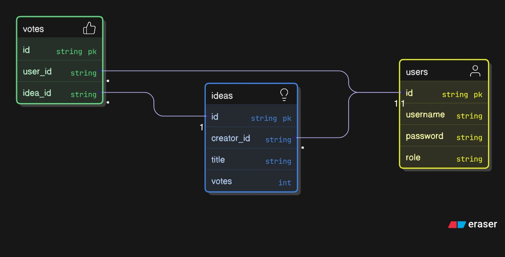

# Arquitetura - Mural de Ideias Backend

Este documento descreve as decisões de arquitetura, padrões utilizados, estratégias de segurança, testes e a decisão técnica mais desafiadora adotada no projeto `Mural de Ideias`, uma API REST desenvolvida com **NestJS**, **TypeORM**, **JWT** e **SQLite/PostgreSQL**.

---

## 🎯 Objetivo do Projeto

Fornecer uma API segura e modular para um sistema de Mural de Ideias, com autenticação por JWT, controle de acesso por perfis, e registro de votos em ideias com integridade garantida.

---

## 📌 Diagrama do Banco



---

## 🧱 Padrões do NestJS utilizados

### 🔹 Modularização por Domínio
Aplicação organizada em módulos com responsabilidade única:

- `AuthModule` – login, signup, estratégia JWT
- `UsersModule` – cadastro, autenticação, alteração de role
- `IdeasModule` – CRUD de ideias e relatório
- `Votes` – entidade relacional usada internamente

### 🔹 Inversão de Dependência
- Uso de `@Injectable()` e `@Inject()` para services e repositórios.
- Repositórios `TypeORM` injetados automaticamente via `@InjectRepository()`.

### 🔹 Configuração Assíncrona
- `TypeOrmModule.forRootAsync(...)` e `JwtModule.registerAsync(...)` usam `ConfigService` e `Joi` para configurar `.env` com validação segura.

---

## 🔐 Como garantimos a validação e proteção das rotas

### ✅ Validação de Dados

- **Variáveis de Ambiente**:
  - Validadas com `Joi` via `ConfigModule.forRoot({ validationSchema })`
- **DTOs e Pipes**:
  - Validadores via `class-validator` e `class-transformer`
  - `ValidationPipe` com `whitelist` e `forbidNonWhitelisted` aplicados globalmente

### ✅ Autenticação e Autorização

- **JWT com Passport.js**:
  - `JwtStrategy` valida token e injeta `req.user`
  - `JwtAuthGuard` aplicado globalmente via `APP_GUARD`

- **Controle de Acesso por Role**:
  - `@Roles('admin')` + `RolesGuard` verificam permissões
  - `@Public()` permite acesso livre a rotas específicas

---

## 🧪 Testes

### Unitários
- `UsersService`, `AuthService`, `IdeasService`: testados com mocks de repositórios TypeORM
- Cobertura de casos de sucesso e exceções (`NotFound`, `Conflict`, `Forbidden`)

### End-to-End
- Simulações completas usando **SuperTest**:
  - Signup/Login
  - Rotas protegidas (verifica 401/403)
  - Criação de ideia, votação e relatórios

### Comandos úteis

```bash
npm run test       # unitários
npm run test:e2e   # testes de integração
npm run test:cov   # cobertura de código
```

---

## ⚙️ Banco de Dados

- **SQLite** em desenvolvimento e **PostgreSQL** em produção
- Chaves primárias UUID
- Entidade `Vote` com `@Unique(['user', 'idea'])` para evitar duplicidade
- Transações para consistência ao votar e atualizar contadores

---

## 🧠 Decisão Técnica Mais Crítica

### Tema: Modelagem de votos

#### ❌ Abordagem Rejeitada
Armazenar array de userIds dentro da entidade `Idea`

- ❗ Simples, mas frágil: quebra consistência, escalabilidade ruim, alto risco de condição de corrida

#### ✅ Abordagem Implementada
Entidade separada `Vote` com FK para `User` e `Idea`, e relação bidirecional

- ✅ Escalável e segura
- ✅ Permite histórico, relatórios, integridade
- ✅ Evita votos duplicados com `@Unique`

### Motivo da Dificuldade
- Aumenta complexidade de código e quantidade de JOINs
- Exige uso de transações e tuning de índices
- Decisão entre performance e integridade

### Conclusão
A modelagem com `Vote` permite crescimento sustentável, controle de concorrência e extensão futura (ex: auditoria, comentários de voto).

---
